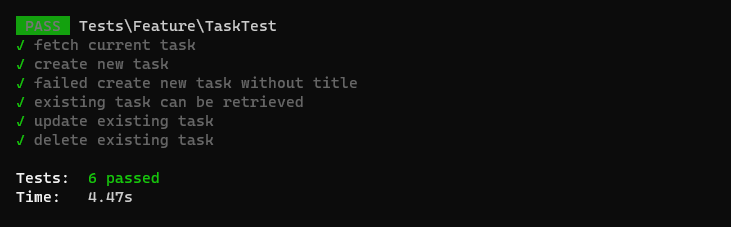

# About Demo-App

This demo is an app demo. A simple RESTful API for "Task Management" using PHP, Laravel Framework.

Laravel is accessible, powerful, and provides tools required for large, robust applications.

This application were hosted in Docker Environment as a container.

# Getting started

This application can be run using either Docker or Standalone PHP Artisan (Preferably Docker).

## Part 1: Guide to setup the container;
1. Rename **.env.sample** to **.env**
2. Create the container
```
docker-compose up -d
```
3. Download all necessary composer required files.
```
docker exec demo-app composer update
```
4. Run Database Migration
```
docker exec demo-app php artisan migrate
```
4. Once all three container is up, API is ready

## Part 2: Setting up Node.JS;
1. Install `npm_modules` by running
```
docker-compose run --rm npm install
```
2. Download all necessary packages for this project.
```
docker-compose run --rm npm install yargs axios cli-table
```
4. Done, we are ready to test this API with our Node.Js script.

# Usage with Node.Js script
> Basic Node.js Script to do a HTTP Request over the API

The script has 4 types and the `--type` argruments is compulsory present.
1. list
2. show
3. add
3. edit
4. delete

**example to list the current available task**
```
docker-compose run --rm npm run-script build -- --type="list"
```

## list
**Parameter**

| Name | Required | Type | Description |
|------|----------|------|-------------|
|`--type`| required | string | type of action. <br/> supported values: `list`,`show`,`edit`,`delete`|

**Response**

If the data were present in database, the result will display:
```
┌───┬─────────┬───────┬─────────────┬────────┐
│ # │ Task ID │ Title │ Description │ Status │
├───┼─────────┼───────┼─────────────┼────────┤
│ 1 │ 6       │ title │ desc        │ 1      │
└───┴─────────┴───────┴─────────────┴────────┘
```

## show
**Parameter**

| Name | Required | Type | Description |
|------|----------|------|-------------|
|`--type`| required | string | type of action. <br/> supported values: `list`,`show`,`edit`,`delete`|
|`--id`| required | integer | id of the task.|

**Response**

If the ID were present in database, the result will display:
```
┌─────────────────┬───────────────────────┐
│ Task ID         │ 6                     │
├─────────────────┼───────────────────────┤
│ Title           │ title                 │
├─────────────────┼───────────────────────┤
│ Description     │ desc                  │
├─────────────────┼───────────────────────┤
│ Status          │ Completed             │
├─────────────────┼───────────────────────┤
│ Created at      │ 12/5/2023, 6:02:01 PM │
├─────────────────┼───────────────────────┤
│ Last updated at │ 12/5/2023, 6:02:01 PM │
└─────────────────┴───────────────────────┘
```

## add
**Parameter**

| Name | Required | Type | Description |
|------|----------|------|-------------|
|`--type`| required | string | type of action. <br/> supported values: `list`,`show`,`edit`,`delete`|
|`--title`| required | integer | title of the new task.|
|`--desc`| optional | integer | description of the new task.|
|`--status`| optional | integer | status of the new task. <br/> supported values: `0`,`1`,`2` |

**Response**

If the parameters all present, the result will display:
```
Task succesfully created!
```

## edit
**Parameter**

| Name | Required | Type | Description |
|------|----------|------|-------------|
|`--type`| required | string | type of action. <br/> supported values: `list`,`show`,`edit`,`delete`|
|`--title`| optional | integer | title of the current task.|
|`--desc`| optional | integer | description of the current task.|
|`--status`| optional | integer | status of the current task. <br/> supported values: `0`,`1`,`2` |

**Response**

If the ID were present in database, the result will display:
```
Task succesfully deleted!
```

## delete
**Parameter**

| Name | Required | Type | Description |
|------|----------|------|-------------|
|`--type`| required | string | type of action. <br/> supported values: `list`,`show`,`edit`,`delete`|
|`--id`| required | integer | id of the task.|

**Response**

If the parameters all present, the result will display:
```
Task changes saved succesfully!
```


# Database Structure
There is only one(1) tables that mainly serves for the application which is `tasks`. The structure is as follows;

| name | type | default | attributes |
| -----|------|---------|------------|
| id | int (10) | - | auto-increment |
| title | varchar (255) | - | no null |
| description | longtext | null | - |
| status | int (11) | 2 | - |
| created_at | timestamp | null | - |
| updated_at | timestamp |  null | - | 


# API Endpoint

## GET /api/tasks
Fetch all available tasks from database and paginate them by five(5) per page.

**Response**
```
{
    "current_page": 1,
    "data": [],
    "first_page_url": "http://localhost/api/tasks?page=1",
    "from": null,
    "last_page": 1,
    "last_page_url": "http://localhost/api/tasks?page=1",
    "links": [
        {
            "url": null,
            "label": "&laquo; Previous",
            "active": false
        },
        {
            "url": "http://localhost/api/tasks?page=1",
            "label": "1",
            "active": true
        },
        {
            "url": null,
            "label": "Next &raquo;",
            "active": false
        }
    ],
    "next_page_url": null,
    "path": "http://localhost/api/tasks",
    "per_page": 5,
    "prev_page_url": null,
    "to": null,
    "total": 0
}
```

The **data** should append all the available rows from database, else will display as `"data": []`. We can do further condition from front-end to query if the data is empty.

## GET /api/tasks/{task_id}
Get and zoom in into particular information regarding the tasks details for a given ID.

**Parameters**

| Name | Required | Type | Description |
|------|----------|------|-------------| 
| `task_id` | required | integer  | The tasks_id for which to fetch information from. <br/>**Note:** The values must be in integer |


**Response**
```
{
    "id": 7,
    "title": "Test Title",
    "description": "Test Description",
    "status": 2,
    "created_at": "2023-12-05T17:50:14.000000Z",
    "updated_at": "2023-12-05T17:50:14.000000Z",
    "currentstatus": "Pending"
}
```

If the `task_id` is **not found**, it will throw 404 Not Found header code.

## POST /api/tasks
To create a new task

**Parameters**

| Name | Required | Type | Description |
|------|----------|------|-------------| 
| `title` | required | string  | Title for the new task |
| `description` | optional | string  | Description for the new task |
| `status` | optional | integer  | The status for the new task. The value must be in integer.<br/>Supported values: `0`,`1`,`2` |

**Response**
```
{
    "id": 7,
    "title": "Test Title",
    "description": "Test Description",
    "status": 2,
    "created_at": "2023-12-05T17:50:14.000000Z",
    "updated_at": "2023-12-05T17:50:14.000000Z",
    "currentstatus": "Pending"
}
```

If the `title` is not **present**, it will throw a validation throw error with `status` is **false**

**Validation throw error**
```
{
    "status": false,
    "messages": "The title field is required."
}
```

## PATCH /api/tasks/{task_id}
To update the values for current task

**Parameters**

| Name | Required | Type | Description |
|------|----------|------|-------------| 
| `task_id` | required | integer | The task for which to perform the update action |
| `title` | optional | string  | New title for the current task |
| `description` | optional | string  | New description for the current task |
| `status` | optional | integer  | New status for the current task. The value must be in integer.<br/>Supported values: `0`,`1`,`2` |

**Response**
```
{
    "status": true,
    "messages": "Task changes saved succesfully!"
}
```

If the `task_id` is **not found**, it will throw 404 Not Found header code.

## DELETE /api/tasks/{task_id}
To delete a task

**Parameters**

| Name | Required | Type | Description |
|------|----------|------|-------------| 
| `task_id` | required | integer | The task for which to perform the update action |

**Response**
```
{
    "status": true,
    "messages": "Task succesfully deleted!"
}
```

If the `task_id` is **not found**, it will throw 404 Not Found header code.

## Status State

From the `Task` modelling, injected a new custom field to translate the status of the task. (ie: pending, completed, cancelled) using array

```
              0           1           2 
status = ['pending', 'completed', 'pending']
```

# Validation and Testing during Development

During the development cycle, all the functionality for each of the API route were tested in few scenario.

1. fetch current task
2. create new task
3. failed create new task without title
4. existing task can be retrieved
5. update existing task
6. delete existing task



To re-assest the result, we can run this command:
```
docker exec demo-app php artisan test --filter TaskTest
```
